  

# ⚡ Awesome Managed NoSQL Key-Value Database 🚀

  
  
  
  
  
  

---

## 📌 Overview & SEO Highlights

Welcome to the definitive, curated index of **Managed NoSQL Key-Value Databases**, **Serverless Data Stores**, and **High-Performance Open-Source NoSQL Engines**.

This directory tracks commercial fully managed SaaS databases (such as *Amazon DynamoDB*, *Google Cloud Bigtable*, *Azure Cosmos DB*, *ScyllaDB Cloud*, *Redis Enterprise*, and *Upstash*) alongside leading open-source distributed engines (*Redis*, *Valkey*, *etcd*, *RocksDB*, *TiKV*, *FoundationDB*, *Apache Cassandra*, and *Dragonfly*). Designed for system architects, backend developers, and cloud engineering teams seeking sub-millisecond latency, serverless auto-scaling, and global active-active data distribution.

---

## 📑 Table of Contents

- [📊 Market Size & Sector Structure](#-market-size--sector-structure)
- [☁️ SaaS & Hosted Managed Platforms](#%EF%B8%8F-saas--hosted-managed-platforms)
- [📦 Open-Source GitHub Projects](#-open-source-github-projects)
- [🤝 How to Contribute](#-how-to-contribute)
- [💖 Support & Sponsoring](#-support--sponsoring)
- [⚠️ Disclaimer & Licensing](#%EF%B8%8F-disclaimer--licensing)
- [⭐ Star History](#-star-history)

---

## 📊 Market Size & Sector Structure

> 📈 **Market Intelligence & Sector Analysis**: The global NoSQL and managed key-value database market is valued at **~$15.2 Billion in 2026** and projected to reach **~$34.5 Billion by 2030** (growing at a CAGR of ~22.8%). The sector is **moderately fragmented**: cloud hyperscalers (AWS, Microsoft Azure, Google Cloud) command substantial volume for general enterprise serverless applications, while specialized database pioneers (ScyllaDB, Redis Ltd, Couchbase, DataStax, Aerospike, Upstash, Fauna) hold commanding market positions in high-throughput, low-latency, and specialized caching/vector workloads.

---

## ☁️ SaaS & Hosted Managed Platforms

Below is the structured index of fully managed SaaS & cloud NoSQL platforms, sorted by **Company Size / Valuation (Descending)**:

| 🏢 Platform | 🏛️ Company / Owner | 💰 Company Valuation / Revenue | 🏷️ Specific Starting Pricing | 🎁 Free Tier / Free Trial Limit | 🚀 Primary Use Case & Key Features |
| :--- | :--- | :--- | :--- | :--- | :--- |
| **[Azure Cosmos DB](https://azure.microsoft.com/en-us/products/cosmos-db/)** | Microsoft | **~$3.1 Trillion** *(Market Cap)* | `$0.008/100 RU/s-hr` (~$5.84/mo provisioned) or `$0.25/1M RUs` *(Serverless)* | **1,000 RU/s throughput & 25 GB storage free forever** per month | Globally distributed multi-model database; active-active multi-region writes. |
| **[Google Cloud Bigtable](https://cloud.google.com/bigtable)** | Alphabet / Google | **~$2.2 Trillion** *(Market Cap)* | `$0.75/node-hour` (~$547/mo per node) or `$0.026/GB/month` SSD storage | **90-day free trial with $300** in Google Cloud credits | Petabyte-scale wide-column NoSQL database powering Google Search & Maps. |
| **[Amazon DynamoDB](https://aws.amazon.com/dynamodb/)** | Amazon (AWS) | **~$2.0 Trillion** *(Market Cap)* | `$0.25 / 1M write request units`, `$0.05 / 1M read request units`, `$0.25/GB-mo` | **25 GB storage, 25 WCU & 25 RCU free forever** per month | Serverless single-digit millisecond latency key-value & document database. |
| **[DataStax Astra DB](https://www.datastax.com/products/datastax-astra)** | DataStax | **~$1.6 Billion** *(Valuation)* | `$0.05 / 1M reads`, `$0.15 / 1M writes`, `$0.25/GB-month` storage | **$25 monthly credit free forever** (~30M reads & 5GB storage) | Managed serverless Apache Cassandra with native vector search capabilities. |
| **[Redis Enterprise Cloud](https://redis.com/cloud/)** | Redis Ltd | **~$1.0 Billion** *(Valuation)* | `$0.007/GB-hour` (~$5.00/month starting 256MB database tier) | **30 MB database instance free forever** (30 concurrent connections) | Managed Redis with active-active geo-distribution, modules & sub-ms latency. |
| **[Aerospike Cloud](https://aerospike.com/)** | Aerospike | **~$1.0 Billion** *(Valuation)* | `$0.15/GB-hour` (~$100/month starting cluster deployment) | **30-day free trial with $500 credits** or 5GB developer sandbox | Real-time sub-millisecond NoSQL database for ad-tech & fraud detection. |
| **[Couchbase Capella](https://www.couchbase.com/products/capella/)** | Couchbase | **~$700 Million** *(Market Cap)* | `$0.29/node-hour` (~$210/month starting operational cluster) | **30-day full-featured free trial** (no credit card required) | Managed document & key-value database with SQL++ query support. |
| **[ScyllaDB Cloud](https://www.scylladb.com/)** | ScyllaDB | **~$150 Million** *(Valuation)* | `$0.32/node-hour` (~$230/month starting 3-node cluster) | **30-day free trial with $500 credit** or free developer sandbox | C++ Cassandra-compatible engine delivering 10x throughput & sub-ms latency. |
| **[Fauna](https://fauna.com/)** | Fauna Inc | **~$100 Million** *(Valuation)* | `$0.05 / 100K reads`, `$0.15 / 100K writes`, `$0.25/GB-month` storage | **100K reads, 50K writes & 5 GB storage free forever** per month | Serverless document/key-value store with strong ACID consistency & GraphQL. |
| **[Upstash Redis](https://upstash.com/)** | Upstash | **~$50 Million** *(Valuation)* | `$0.20 per 100K requests`, `$0.25/GB-month` storage | **10,000 requests/day & 256 MB storage free forever** per month | Serverless Redis with per-request pricing, global replication & REST API. |

---

## 📦 Open-Source GitHub Projects

The open-source ecosystem provides powerful building blocks for distributed storage, in-memory caching, embedded key-value engines, and document databases.

Below are top open-source projects sorted by **GitHub Stars_Count (Descending)**:

1. **[Redis](https://github.com/redis/redis)** 
   - 📜 **License**: RSALv2 / SSPL
   - ⚡ **Description**: The world's most popular in-memory key-value store. Features sub-millisecond speed, rich data structures (hashes, lists, sets, streams), pub/sub messaging, and Lua scripting.
   - 🎯 **Best For**: Real-time caching, session management, leaderboards, and message queues.

2. **[etcd](https://github.com/etcd-io/etcd)** 
   - 📜 **License**: Apache-2.0
   - ⚡ **Description**: Distributed, consistent key-value store using the Raft consensus algorithm. Serves as the primary state store for Kubernetes clusters worldwide.
   - 🎯 **Best For**: Distributed configuration management, service discovery, and coordination primitives.

3. **[LevelDB](https://github.com/google/leveldb)** 
   - 📜 **License**: BSD-3-Clause
   - ⚡ **Description**: Fast embedded key-value storage library developed by Google. Implements an ordered LSM-tree structure for write-heavy persistent workloads.
   - 🎯 **Best For**: Local application storage, embedded database engines, and browser storage engines.

4. **[SurrealDB](https://github.com/surrealdb/surrealdb)** 
   - 📜 **License**: BSL 1.1 / Apache-2.0
   - ⚡ **Description**: Multi-model cloud-native database supporting key-value, document, graph, vector, and temporal data models in a unified engine with SurrealQL.
   - 🎯 **Best For**: Modern web applications, real-time backend services, and multi-model data access.

5. **[CockroachDB](https://github.com/cockroachdb/cockroach)** 
   - 📜 **License**: BSL 1.1
   - ⚡ **Description**: Cloud-native distributed SQL database built on top of a transactional distributed key-value storage engine with serializable ACID guarantees.
   - 🎯 **Best For**: Distributed cloud transactions, multi-region SQL, and resilient data storage.

6. **[RocksDB](https://github.com/facebook/rocksdb)** 
   - 📜 **License**: Apache-2.0 / GPL-2.0
   - ⚡ **Description**: High-performance embedded persistent key-value store developed by Meta, optimized for fast flash storage and low latency.
   - 🎯 **Best For**: Powering underlying storage engines of MySQL (MyRocks), TiKV, CockroachDB, and Kafka streams.

7. **[Dragonfly](https://github.com/dragonflydb/dragonfly)** 
   - 📜 **License**: BSL 1.1
   - ⚡ **Description**: Modern in-memory data store fully compatible with Redis and Memcached APIs. Built with a shared-nothing multi-threaded architecture yielding up to 25x throughput over Redis.
   - 🎯 **Best For**: High-throughput memory caching, heavy concurrency workloads, and drop-in Redis replacement.

8. **[MongoDB](https://github.com/mongodb/mongo)** 
   - 📜 **License**: SSPL
   - ⚡ **Description**: Leading document-oriented NoSQL database storing JSON-like documents with dynamic schemas, rich indexing, horizontal sharding, and aggregation pipelines.
   - 🎯 **Best For**: Content management, e-commerce catalogues, mobile app backends, and document processing.

9. **[Valkey](https://github.com/valkey-io/valkey)** 
   - 📜 **License**: BSD-3-Clause
   - ⚡ **Description**: Open-source fork of Redis supported by Linux Foundation, AWS, Google Cloud, and Oracle. Maintains full Redis API compatibility with open governance.
   - 🎯 **Best For**: Open-source in-memory caching and session management without proprietary license restrictions.

10. **[RethinkDB](https://github.com/rethinkdb/rethinkdb)** 
    - 📜 **License**: Linux Foundation (Apache-2.0)
    - ⚡ **Description**: Open-source real-time database designed to push JSON updates to applications continuously using changefeeds.
    - 🎯 **Best For**: Real-time dashboards, collaborative apps, and live feeds.

11. **[TiKV](https://github.com/tikv/tikv)** 
    - 📜 **License**: Apache-2.0
    - ⚡ **Description**: CNCF Graduated distributed transactional key-value database written in Rust. Features Raft consensus and multi-version concurrency control (MVCC).
    - 🎯 **Best For**: Distributed transactional OLTP workloads, TiDB storage layer, and cloud-native state stores.

12. **[FoundationDB](https://github.com/apple/foundationdb)** 
    - 📜 **License**: Apache-2.0
    - ⚡ **Description**: Open-source distributed key-value store maintained by Apple. Provides strict ACID multi-key transactions with scalable ordered key-value storage.
    - 🎯 **Best For**: Foundation layer for multi-tenant cloud storage, custom database engines, and stateful cloud services.

13. **[ScyllaDB](https://github.com/scylladb/scylladb)** 
    - 📜 **License**: AGPL-3.0
    - ⚡ **Description**: High-performance Cassandra-compatible wide-column NoSQL database rewritten in C++ using an asynchronous shard-per-core architecture.
    - 🎯 **Best For**: Ultra-high throughput distributed data stores, IoT sensor streams, and zero-GC performance requirements.

14. **[BadgerDB](https://github.com/dgraph-io/badger)** 
    - 📜 **License**: Apache-2.0
    - ⚡ **Description**: Fast, embeddable key-value store written in pure Go, optimized for SSD performance by separating keys from values (WISC-Key architecture).
    - 🎯 **Best For**: Native Go projects, embedded key-value storage, and Dgraph storage engine.

15. **[Memcached](https://github.com/memcached/memcached)** 
    - 📜 **License**: BSD-3-Clause
    - ⚡ **Description**: High-performance, distributed memory object caching system designed to speed up dynamic web applications by alleviating database load.
    - 🎯 **Best For**: Simple string key-value caching, transient session data, and ultra-lightweight memory caching.

16. **[ArangoDB](https://github.com/arangodb/arangodb)** 
    - 📜 **License**: Apache-2.0 / Enterprise
    - ⚡ **Description**: Native multi-model database supporting key-value pairs, document collections, and graph structures with a unified query language (AQL).
    - 🎯 **Best For**: Graph analytics, multi-model microservices, and unified key-value/document applications.

17. **[KeyDB](https://github.com/Snapchat/KeyDB)** 
    - 📜 **License**: BSD-3-Clause
    - ⚡ **Description**: High-performance, multi-threaded fork of Redis created by Snapchat. Offers full Redis compatibility, active-active replication, and FLASH storage support.
    - 🎯 **Best For**: High-concurrency Redis workloads needing multi-core CPU scaling.

18. **[Garnet](https://github.com/microsoft/garnet)** 
    - 📜 **License**: MIT
    - ⚡ **Description**: Remote cache-store from Microsoft Research built on TsFast. Designed for extreme performance, low latency, and full Redis RESP protocol compatibility.
    - 🎯 **Best For**: Enterprise caching, low-latency microservices, and high-density memory stores.

19. **[FerretDB](https://github.com/FerretDB/FerretDB)** 
    - 📜 **License**: Apache-2.0
    - ⚡ **Description**: Open-source proxy translating MongoDB protocol queries into SQL statements executed on top of PostgreSQL or SQLite engines.
    - 🎯 **Best For**: MongoDB replacement using standard open-source relational backend.

20. **[YugabyteDB](https://github.com/yugabyte/yugabyte-db)** 
    - 📜 **License**: Apache-2.0
    - ⚡ **Description**: Open-source distributed SQL database with a document-oriented key-value storage engine (DocDB) providing PostgreSQL and Cassandra API compatibility.
    - 🎯 **Best For**: Multi-region distributed SQL and wide-column key-value storage.

21. **[Apache Cassandra](https://github.com/apache/cassandra)** 
    - 📜 **License**: Apache-2.0
    - ⚡ **Description**: Benchmark open-source distributed wide-column NoSQL database. Features linear scalability, peer-to-peer architecture with no single point of failure, and multi-datacenter replication.
    - 🎯 **Best For**: High-throughput distributed writes, global cloud scale, and fault-tolerant storage.

22. **[Apache CouchDB](https://github.com/apache/couchdb)** 
    - 📜 **License**: Apache-2.0
    - ⚡ **Description**: Document database featuring a RESTful HTTP JSON API, MapReduce view queries, and reliable multi-master bidirectional sync replication.
    - 🎯 **Best For**: Offline-first applications, edge synchronization, and couch-to-cloud data replication.

23. **[LMDB](https://github.com/LMDB/lmdb)** 
    - 📜 **License**: OpenLDAP Public License
    - ⚡ **Description**: Lightning Memory-Mapped Database (LMDB). Ultra-fast, memory-mapped key-value store embedded library with full ACID transactions.
    - 🎯 **Best For**: Embedded high-performance read-heavy storage engines.

---

## 🤝 How to Contribute

Contributions from the developer community are warmly welcomed! Please follow these simple guidelines:

1. **Fork the Repository**: Click the **Fork** button at the top right of this repository.
2. **Add or Edit Entries**: Update entries in `README.md` following the tabular or bulleted format.
3. **Include Required Details**: Ensure entries list the **Official Name**, **Website/Repo Link**, **Specific Starting Price / Stars_Badge**, **Free Tier Limits**, and a concise description.
4. **Submit a Pull Request**: Create a PR with a short explanation of your changes.

Check out our full awesome directory collection at **[Awesome-Awesome-Awesome](https://github.com/ishandutta2007/Awesome-Awesome-Awesome)**!

---

## 💖 Support & Sponsoring

Thank you for exploring and using **Awesome Managed NoSQL Key-Value Database**!

If this list has helped you evaluate database infrastructure or discover new platforms, please consider supporting the project:

- ⭐ **Star this repository** to help others discover it!
- 🔀 **Fork & Share** it with backend engineers, DevOps teams, and architects.
- ☕ **Buy me a coffee / Sponsor**: Support ongoing maintenance via [GitHub Sponsors](https://github.com/sponsors/ishandutta2007).

  

---

## ⚠️ Disclaimer & Licensing

- **Community Curated**: This list is independently curated for educational and architectural reference purposes.
- **Licensing Compliance**: Note that Redis uses RSALv2/SSPL, MongoDB uses SSPL, Dragonfly/CockroachDB use BSL 1.1, ScyllaDB uses AGPL-3.0, and Cassandra/etcd use Apache-2.0. Always verify software licenses against your organization's compliance policy.
- **Consistency & Data Modeling**: Managed NoSQL key-value stores differ significantly from relational RDBMS models. Evaluate consistency guarantees (eventual vs. strong ACID) and partition key design carefully before deployment.

---

## ⭐ Star History

---

  <b>Made with ❤️ for backend engineers, platform teams, and database architects worldwide.</b>

